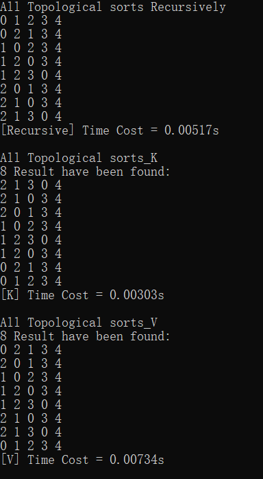
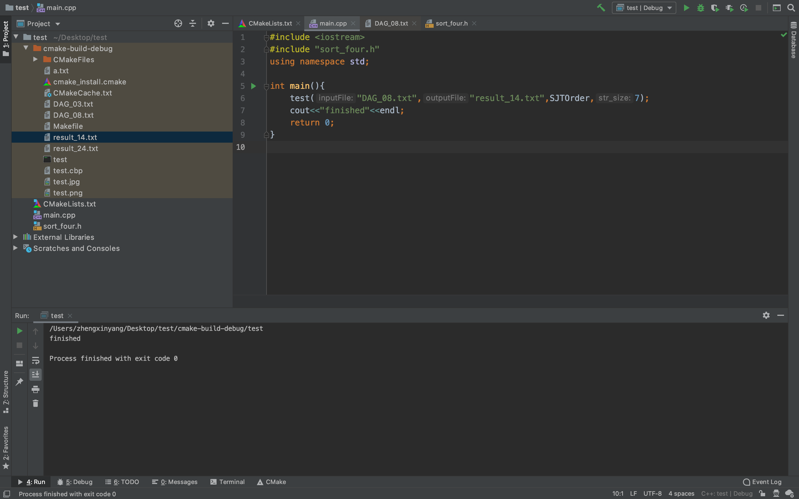

# 代码说明

## 环境
* Windows 10, 64位
* Visual Studio 2017

## 使用说明
1. 编译代码，获得`TopSort.exe`
2. 在相同路径下创建`DAG.txt`，其中包含拓扑图信息，某一示例为：
```
6
2 3
1 3
0 4
1 4
0 5
2 5
```
其中第1行为节点数目`N`，第2至最后一行记录节点之间偏序关系；以`2 3`为例，表示图中包含结构`2 --> 3`，即存在节点`2`指向`3`的边

3. 运行，输出结果
    以上示例输出结果如下（3种拓扑排序方式）
    

## 四种全排列算法的实现

主要代码在头文件sort_four.h中，该头文件主要包含5个函数，分别是：

```c++
string lexicographicalOrder(string origin, int n);
```

返回字典序法下origin往后的第$n$个排列；

```c++
string increaseOrder(string origin, int n);
```

返回递增进位制法下origin往后的第$n$个排列；

```c++
string decreaseOrder(string origin, int n);
```

返回递减进位制法下origin往后的第$n$个排列；

```c++
string SJTOrder(string origin, int n);
```

返回邻位对换法下origin往后的第$n$个排列；

```c++
void test(const string& inputFile,const string& outputFile,string (*pfun)(string,int));
```

其中inputFile为输入文本文件（拓扑排序的约束），outputFile为输出文本文件（在某种全排列生成算法下满足拓扑排序的序列在整个序列中的分布）,pfun为选择的全排列生成算法（字典序法、递增进位制法、递减进位制法、邻位对换法）。


result文件夹中，result_11.txt到result_14.txt分别为拓扑约束满足DAG_less.txt中的约束时满足拓扑排序的序列在整个排列中的分布，result_21.txt到result_24.txt分别为拓扑约束满足DAG_more.txt中的约束时满足拓扑排序的序列在整个排列中的分布。（1指字典序法，2指递增进位制法，3指递减进位制法，4指邻位对换法），result_11.png到result_24.png为可视化的结果。

测试结果如下：


## 相邻交换法的实现

主要的实现在algo_v.h 和 algo_v.cpp的文件里。
```c++
#define FILE_NAME "DAG.txt"
```
定义了拓扑约束的输入，以文件形式存储。其中文件第一行表示全部元素数目，第二行以后表示约束，要求左边的数在排列中位于右边的数之前

```c++
void algo_v::all_topological_sorts_K();
```
算法的主要实现在类内的这个函数中

## 递归法
实现于`DiGraph.h`和`DiGraph.txt`中

其中`DiGraph`类定义有向图结构

递归法定义于
* 主入口函数：`DiGraph::alltopologicalSortRecursive()`
* 递归函数：`DiGraph::alltopologicalSortUtil(vector<int>& res, bool visited[])`

## 算法K
主要算法来自于
```
Donald E. Knuth, Jayme Luiz Szwarcfiter:
A Structured Program to Generate all Topological Sorting Arrangements. Inf. Process. Lett. 2(6): 153-157 (1974)
```
并受到python软件包[neworkx](https://networkx.github.io/)启发实现

定义于`DiGraph::all_topological_sorts_K`
